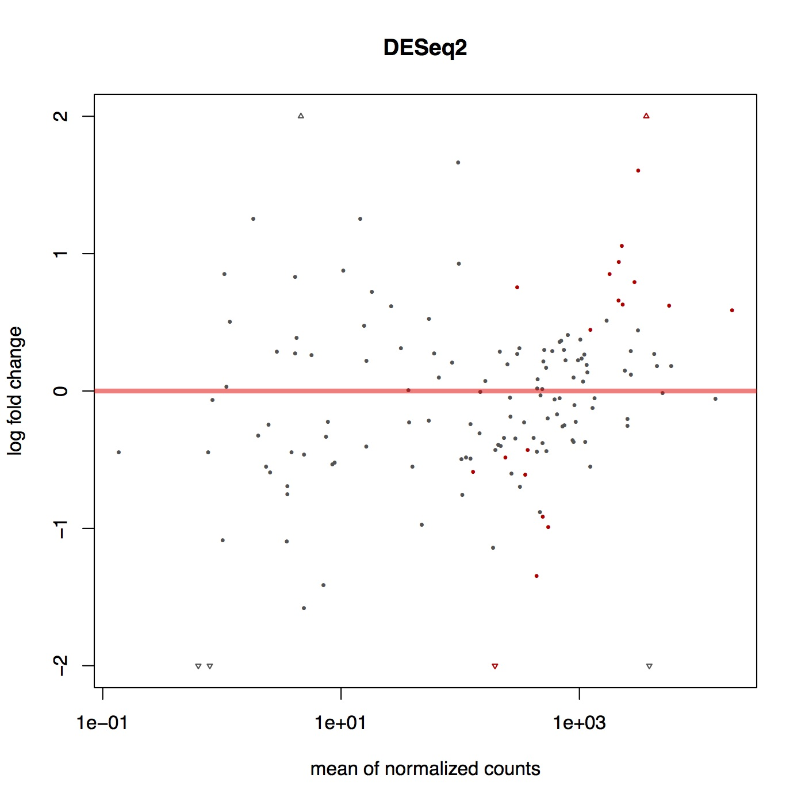
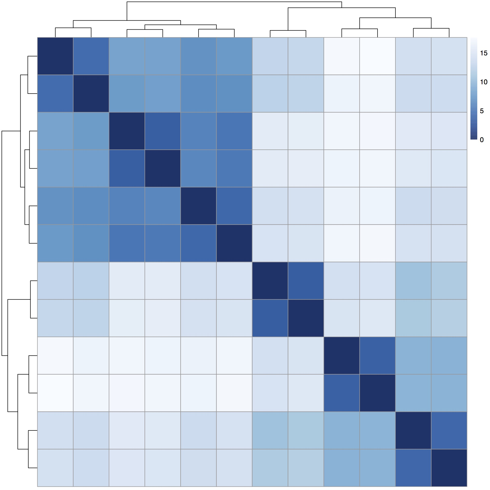
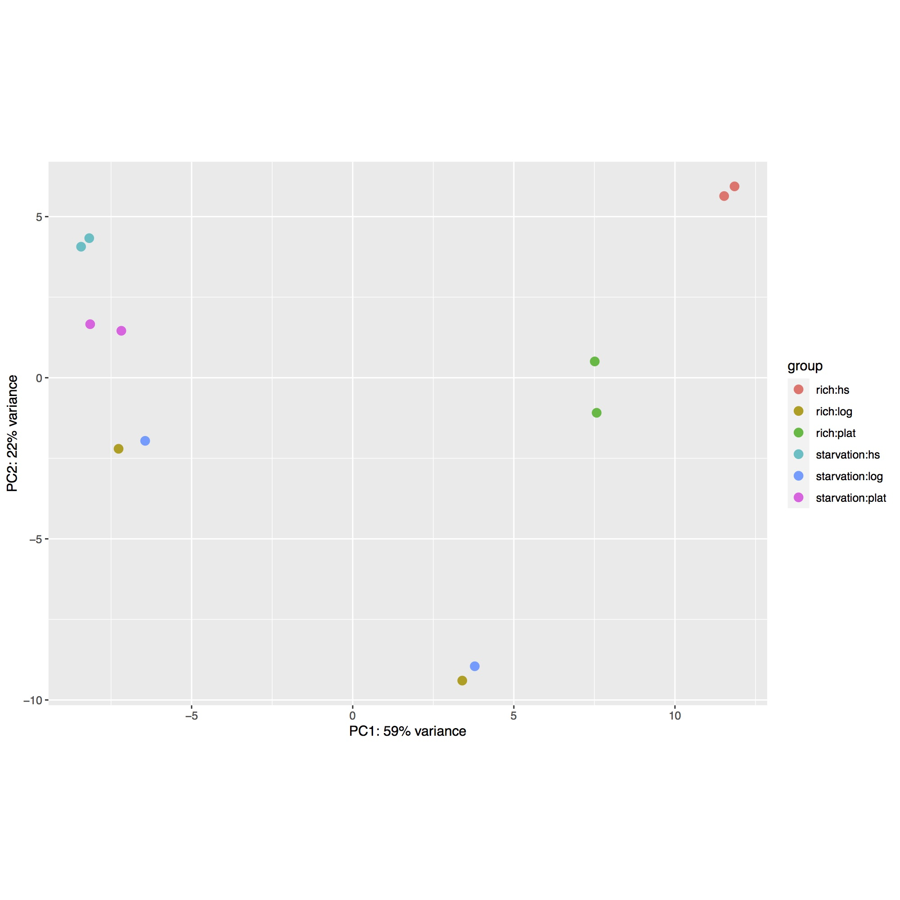
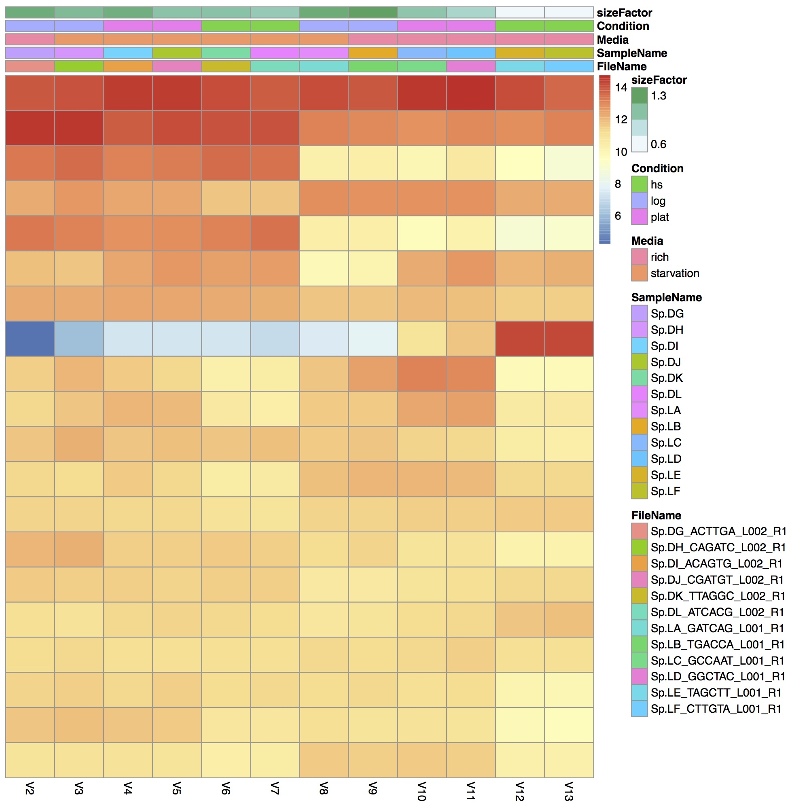
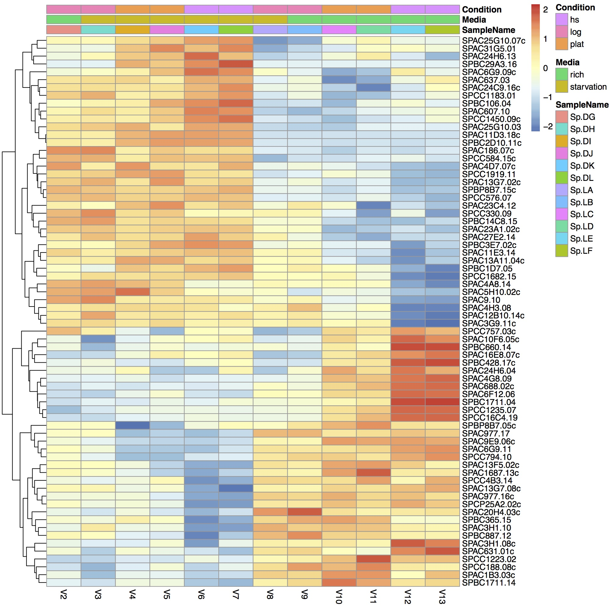

> ## Objetivos de aprendizaje {.objectives}
>
> *  Aprender a realizar análisis de expresión diferencial usando DESeq2

> ## Datos requeridos {.prereq}
>
> Para proceder con esta práctica, se requieren:
>
> *  El genoma `Sp_genome.fa`
> *  Las lecturas no filtradas 

Utilizaremos los archivos bam filtrados por calidad que utilizamos en la clase 
de mapeo. Los análisis se realizaran en la plataforma R.

Generemos un directorio de trabajo en su directorio de preferencia

~~~ {.bash}
$ mkdir DESEQ2
$ cd DESEQ2/
~~~

## Contando lecturas

El primer paso es contar lecturas. Tanto DESeq2 como otros programas que usan
la distribución negativa binomial utilizan conteos **crudos** (raw). Esto 
se refiere la número de lecturas que alinean a un transcrito específico sin 
sufrir ningún tipo de transformación. Como vieron en la clase pasada, esto se 
debe a que el programa estima un factor de normalización. Si usamos datos 
previamente normalizados estaremos violando los supuestos. 

Descargaremos la anotación de los de *Schizosaccharomyces pombe* genes de aquí:

~~~ {.bash}
$ wget https://liz-fernandez.github.io/PBI_transcriptomics_2021/DATA/Sp_genes.gtf
~~~

Usaremos el programa [HTSeq](https://pypi.python.org/packages/source/H/HTSeq/). Ya se encuentra 
instalado en Docker.

Este programa cuenta el número de lecturas que alinean con cada gen anotado en un archivo 
de referencia. Nosotros le proporcionaremos nuestro archivo `Sp_genes.gtf`.

~~~ {.bash}
$ htseq-count -f bam -s no -r pos Sp_ds_sorted.bam /usr/local/data/Sp_genes.gtf > Sp_ds.counts 
$ htseq-count -f bam -s no -r pos Sp_hs_sorted.bam /usr/local/data/Sp_genes.gtf > Sp_hs.counts 
$ htseq-count -f bam -s no -r pos Sp_log_sorted.bam /usr/local/data/Sp_genes.gtf > Sp_log.counts 
$ htseq-count -f bam -s no -r pos Sp_plat_sorted.bam /usr/local/data/Sp_genes.gtf > Sp_plat.counts 
~~~

Veamos uno de los archivos de cuentas, primero las primeras 10 líneas:

~~~ {.bash}
$ head Sp_ds.count
~~~

~~~ {.output}
SPAC1002.19	23
SPAC1093.06c	48
SPAC10F6.01c	362
SPAC10F6.05c	91
SPAC11D3.18c	25
SPAC11E3.06	28
SPAC11E3.14	399
SPAC11H11.04	16
SPAC1250.07	71
SPAC12B10.14c	70
~~~

Y las últimas 10 líneas:

~~~ {.bash}
$ tail Sp_ds.count
~~~

~~~ {.output}
SPCC736.05	18
SPCC736.12c	57
SPCC757.03c	1064
SPCC794.10	68
SPCP25A2.02c	49
__no_feature	0
__ambiguous	2
__too_low_aQual	5483
__not_aligned	1579
__alignment_not_unique	3
~~~

Estas líneas al final del ejemplo muestran lecturas que:

1. **No feature**	Lecturas que no alinean a una región anotada (gen)
1. **Ambiguous**	Lecturas que alinean a más de un gen 
1. **Too low alignment quality**	Lecturas con baja calidad de alineamiento
1. **Not aligned**	Lecturas no alineadas
1. **Alignment not unique**	Lecturas que alinean más de una vez a la referencia

> ## Contando librerías de manera independiente {.challenge}
>
> ¿Por qué contamos las lecturas en cada librería de manera independiente si
> ensamblamos el transcriptoma de referencia usando todas las librerías (muestras)? 
> 

Es importante verificar que el conteo de HTSeq engloba a la mayoría de las lecturas. 
Si estos porcentajes son muy bajos podrían indicar problemas con los parámetros de 
conteo (e.g. si le decimos que nuestra muestra no tiene direccionalidad (strandness)
cuando si la tiene).

Para realizar nuestros análisis de expresión debemos eliminar estas líneas. Uniremos los resultados usando el siguiente comando:

~~~ {.bash}
$ paste *counts | cut -f 1,2,4,6,8 | grep '__' -v > Sp_counts_table.txt
$ head Sp_counts_table.txt
~~~

Esto unió los distintos archivos en uno solo el cual ya podemos utilizar en R. 
Es importante verificar el orden de pegado de los archivos para no confundir una 
muestra con otra. 

~~~ {.output}
SPAC1002.19	23	44	2	230
SPAC1093.06c	48	22	34	59
SPAC10F6.01c	362	323	527	200
SPAC10F6.05c	91	149	54	203
SPAC11D3.18c	25	11	12	23
SPAC11E3.06	28	8	5	4
SPAC11E3.14	399	148	53	387
SPAC11H11.04	16	6	12	23
SPAC1250.07	71	36	29	72
SPAC12B10.14c	70	37	52	47
~~~

### Análisis de expresión diferencial

Ahora usaremos R. Puedes hacer esto directamente en Docker o descargar la tabla de cuentas a tu computadora. Cargamos el paquete `DESeq2`:

~~~ {.r}
> library(“DESeq2”)
~~~

Este paquete estima una distribución binomial negativa.

Leemos las cuentas en R usando read.delim:

~~~ {.r}
> countData <- read.delim("./Sp_counts_table.txt",header=FALSE, row.names=1)
> head(countData)
~~~

~~~ {.output}
              V2  V3  V4  V5
SPAC1002.19   23  44   2 230
SPAC1093.06c  48  22  34  59
SPAC10F6.01c 362 323 527 200
SPAC10F6.05c  91 149  54 203
SPAC11D3.18c  25  11  12  23
SPAC11E3.06   28   8   5   4
~~~ 

Y añadimos la descripción de cada una de las muestras. 
Este es el orden en el cual las "pegamos" usando el comando `paste`. 
Como ya mencionamos, en sus experimentos deberán cerciorarse de que este orden es 
el correcto.

~~~ {.r}
> condition <- factor(c("ds","hs","log","plat"))
> colData <- data.frame(row.names=colnames(countData), condition)
> head(colData)
~~~

~~~ {.output}
   condition
V2        ds
V3        hs
V4       log
V5      plat
~~~ 

Una vez ensamblados nuestros datos podemos usar la función DESeqDataSetFromMatrix para 
ponerlo en el formato requerido por DESeq2:

~~~ {.r}
> dds <- DESeqDataSetFromMatrix(countData = countData,
                              colData = colData,
                              design = ~ condition )
> dds
~~~

~~~ {.output}
class: DESeqDataSet 
dim: 200 4 
exptData(0):
assays(1): counts
rownames(200): SPAC1002.19 SPAC1093.06c ... SPCC794.10 SPCP25A2.02c
rowData metadata column names(0):
colnames(4): V2 V3 V4 V5
colData names(1): condition
~~~

Filtramos genes con muy muy baja expresión, en este caso todos aquellos que no tengan al
menos una lectura. Nota: DESeq2 aplica otros filtros más estrictos por default.

~~~ {.r}
> dds <- dds[ rowSums(counts(dds)) > 1, ]
> dds
~~~

~~~ {.output}
class: DESeqDataSet 
dim: 198 4 
exptData(0):
assays(1): counts
rownames(198): SPAC1002.19 SPAC1093.06c ... SPCC794.10 SPCP25A2.02c
rowData metadata column names(0):
colnames(4): V2 V3 V4 V5
colData names(1): condition
~~~ 

La funcion DESeq realiza el análisis estándar de expresión diferencial, 
incluyendo los pasos de estimación de la distribución. 
Esta función genera una tabla con cambios de expresión en base log2, 
así como p-values y p-values ajustados por pruebas múltiples. 

~~~ {.r}
> dds <- DESeq(dds)
~~~

~~~ {.output}
estimating size factors
estimating dispersions
Error in checkForExperimentalReplicates(object, modelMatrix) :

  The design matrix has the same number of samples and coefficients to fit,
  so estimation of dispersion is not possible. Treating samples
  as replicates was deprecated in v1.20 and no longer supported since v1.22.
~~~

Este error nos indica que DESeq2 no nos permite realizar el análisis debido a la falta de réplicas; no tiene manera de saber cuanta dispersión en 
los niveles de expresión se debe a variación biológica o a diferencia entre los 
distintos tratamientos. Por lo tanto no podemos hacer expresión diferencial con estos datos. 

Realizaremos el análisis con un set de datos distinto que descargaremos así:

~~~ {.bash}
$ wget https://liz-fernandez.github.io/PBI_transcriptomics_2021/DATA/Sp_counts_table_complete.txt
$ wget https://liz-fernandez.github.io/PBI_transcriptomics_2020/DATA/Sp_sample_info.txt
~~~

Leemos las cuentas en R usando read.delim:

~~~ {.r}
> countData <- read.delim("./Sp_counts_table_complete.txt",header=FALSE, row.names=1)
> head(countData)
~~~

~~~ {.output}
                V2    V3    V4    V5    V6    V7    V8    V9   V10   V11   V12
SPAC1002.19     15    10     5     6     6     2     4     5     2     1     2
SPAC1093.06c  6257  7345  6361  5570  3585  3388  9602  9742  7702  6697  2781
SPAC10F6.01c     1     0     0     0     0     0     0     0     0     0     0
SPAC10F6.05c   380   260   360   346   362   361   356   399   414   331   275
SPAC11D3.18c    36    30   147   176   174   151     0     0     0     0     0
SPAC11E3.06  19491 18797 27019 24121 19250 15293 23490 21142 26245 25419 10869
              V13
SPAC1002.19     4
SPAC1093.06c 2802
SPAC10F6.01c    0
SPAC10F6.05c  260
SPAC11D3.18c    0
SPAC11E3.06  7484
~~~ 

Y añadimos la descripción de cada una de las muestras. 
Este es el orden en el cual las "pegamos" usando el comando `paste`. 
Como ya mencionamos, en sus experimentos deberán cerciorarse de que este orden es 
el correcto.

~~~ {.r}
> colData <- read.delim("./Sp_sample_info.txt")
> head(colData)
~~~

~~~ {.output}
              FileName SampleName   Media Condition
1 Sp.DG_ACTTGA_L002_R1      Sp.DG       rich    log
2 Sp.DH_CAGATC_L002_R1      Sp.DH starvation    log
3 Sp.DI_ACAGTG_L002_R1      Sp.DI starvation   plat
4 Sp.DJ_CGATGT_L002_R1      Sp.DJ starvation   plat
5 Sp.DK_TTAGGC_L002_R1      Sp.DK starvation     hs
6 Sp.DL_ATCACG_L002_R1      Sp.DL starvation     hs
~~~ 

Una vez ensamblados nuestros datos podemos usar la función DESeqDataSetFromMatrix para 
ponerlo en el formato requerido por DESeq2:

~~~ {.r}
> dds <- DESeqDataSetFromMatrix(countData = countData,
                              colData = colData,
                              design = ~ Media + Condition )
> dds
~~~

~~~ {.output}
dim: 200 12
metadata(1): version
assays(1): counts
rownames(200): SPAC1002.19 SPAC1093.06c ... SPCC794.10 SPCP25A2.02c
rowData names(0):
colnames(12): V2 V3 ... V12 V13
colData names(4): FileName SampleName Media Condition
~~~

Filtramos genes con muy muy baja expresión, en este caso todos aquellos que no tengan al
menos una lectura. Nota: DESeq2 aplica otros filtros más estrictos por default.

~~~ {.r}
> dds <- dds[ rowSums(counts(dds)) > 1, ]
> dds
~~~

~~~ {.output}
class: DESeqDataSet
dim: 146 12
metadata(1): version
assays(1): counts
rownames(146): SPAC1002.19 SPAC1093.06c ... SPCC794.10 SPCP25A2.02c
rowData names(0):
colnames(12): V2 V3 ... V12 V13
colData names(4): FileName SampleName Media Condition
~~~ 

La funcion DESeq realiza el análisis estándar de expresión diferencial, 
incluyendo los pasos de estimación de la distribución. 
Esta función genera una tabla con cambios de expresión en base log2, 
así como p-values y p-values ajustados por pruebas múltiples. 

~~~ {.r}
> dds <- DESeq(dds)
~~~

~~~ {.output}
estimating size factors
estimating dispersions
gene-wise dispersion estimates
mean-dispersion relationship
final dispersion estimates
fitting model and testing
~~~

~~~ {.r}
> dds
~~~

~~~ {.output}
class: DESeqDataSet
dim: 146 12
metadata(1): version
assays(4): counts mu H cooks
rownames(146): SPAC1002.19 SPAC1093.06c ... SPCC794.10 SPCP25A2.02c
rowData names(30): baseMean baseVar ... deviance maxCooks
colnames(12): V2 V3 ... V12 V13
colData names(5): FileName SampleName Media Condition sizeFactor
~~~

> ## Diseño multifactorial {.callout}
> 
> Experimentos con mas de un factor se pueden analizar usando DESeq2 al incluirse 
> las variables adicionales. Por ejemplo, si se realizaron los mismos experimentos 
> en distintos grupos o batches podemos corregir errores experimentales. 
> Cada factor añadido incrementa la sensibilidad a diferencias causadas por la condición. 
> 
> Por ejemplo, podríamos añadir los siguientes factores
>
> ~~~ {.output}
> colData(dds)
> ## DataFrame with 7 rows and 3 columns
> ## condition type sizeFactor
> ## <factor> <factor> <numeric>
> ## treated1fb treated single-read 1.512
> ## treated2fb treated paired-end 0.784
> ## treated3fb treated paired-end 0.896
> ## untreated1fb untreated single-read 1.050
> ## untreated2fb untreated single-read 1.659
> ## untreated3fb untreated paired-end 0.712
> ## untreated4fb untreated paired-end 0.784
> ~~~
>
> Y analizarlos así para comparar el tipo de librería con el tratamiento
> 
> ~~~ {.r}
> design(ddsMF) <- formula(~ type + condition)
> ddsMF <- DESeq(ddsMF)
> ~~~
>

Podemos extraer los resultados usando la función res:

~~~ {.r}
> res <- results(dds)
> res
~~~

~~~ {.output}
log2 fold change (MLE): Condition plat vs hs
Wald test p-value: Condition plat vs hs
DataFrame with 146 rows and 6 columns
                     baseMean     log2FoldChange             lfcSE
                    <numeric>          <numeric>         <numeric>
SPAC1002.19  4.89457178999425 -0.460608323181358 0.805416964949504
SPAC1093.06c 5672.28872528616  0.620536746571423 0.202381540521687
SPAC10F6.05c 343.532247082905 -0.225967126923073 0.123835854358009
SPAC11D3.18c 54.5873729332635 -0.213881771098801  2.85191464522231
SPAC11E3.06  19141.8791788776  0.589633334870796 0.162658793986188
...                       ...                ...               ...
SPCC736.05   1.16770368760024  0.503372494345891   1.4600169669698
SPCC736.12c  877.447281097385 -0.355570380742308 0.227360578538931
SPCC757.03c  440.248543141121 -0.440419439002333 0.346614951967857
SPCC794.10   413.581224562799 -0.338525318153758 0.270403663791301
SPCP25A2.02c 682.022930152721  0.360732526832397 0.378584434588906
                            stat               pvalue                padj
                       <numeric>            <numeric>           <numeric>
SPAC1002.19   -0.571888032194897    0.567397832415822                  NA
SPAC1093.06c    3.06617266066777  0.00216818070795727  0.0182488542919737
SPAC10F6.05c   -1.82473103685951   0.0680416272225566   0.254526087017712
SPAC11D3.18c -0.0749958528587479    0.940218011541381                  NA
SPAC11E3.06     3.62497053138648 0.000288994403058294 0.00324315941209863
...                          ...                  ...                 ...
SPCC736.05     0.344771674394043    0.730266029436484                  NA
SPCC736.12c     -1.5639051546547    0.117839843808318   0.325396013931216
SPCC757.03c    -1.27063023825693    0.203860224277818     0.3974331536154
SPCC794.10     -1.25192578165299    0.210596909297071   0.401326185641588
SPCP25A2.02c   0.952845637259509    0.340668287387647    0.56405732829758
~~~

Podemos obtener más información acerca de cada columna:

~~~ {.r}
> mcols(res)$description
~~~

~~~ {.output}
[1] "mean of normalized counts for all samples"   
[2] "log2 fold change (MAP): condition plat vs ds"
[3] "standard error: condition plat vs ds"        
[4] "Wald statistic: condition plat vs ds"        
[5] "Wald test p-value: condition plat vs ds"     
[6] "BH adjusted p-values"
~~~ 

La primera columna nos muestra las cuentas normalizadas de cada columna, 
la segunda la razón de cambio en logaritmo base 2 entre las condiciones plat y ds, la tercera el error estándar entre estas condiciones. La otra columna que no es muy importante es la número 6, que nos muestra el valor p ajustado por pruebas múltiples (FDR). 

La función `summary` nos proporciona un resumen de los indicadores de nuestros
resultados.

~~~ {.r}
> summary(res)
~~~

~~~ {.output}
out of 146 with nonzero total read count
adjusted p-value < 0.1
LFC > 0 (up)       : 12, 8.2%
LFC < 0 (down)     : 8, 5.5%
outliers [1]       : 0, 0%
low counts [2]     : 45, 31%
(mean count < 60)
[1] see 'cooksCutoff' argument of ?results
[2] see 'independentFiltering' argument of ?results
~~~

En breve tenemos 45 genes con pocas cuentas, 8 que bajan su expresión significativamente entre las condiciones plat y ds, y 12 que aumentan su expresión significativamente entre estos dos tratamientos. 

¿Qué nos sugieren estos resultados? Si vemos una gráfica MA vemos pocos genes que se expresan de manera diferencial significativa:

~~~ {.r}
pdf("MA_plot-Sp.pdf")
plotMA(res, main="DESeq2", ylim=c(-2,2))
dev.off()
~~~

Como pueden ver estos resultados solo muestran la comparación entre las condiciones
'plat' y 'ds'. Para extraer otros contrastes extraemos distintas parte de los 
resultados guardados en dds usando la función `results`.

Extraemos todas las combinaciones:

~~~ {.r}
res_rich_vs_starvation <- results(dds,contrast=c("Media","rich","starvation"))
res_log_vs_plat <- results(dds,contrast=c("Condition","log","plat"))
res_log_vs_hs <- results(dds,contrast=c("Condition","log","hs"))
res_plat_vs_hs <- results(dds,contrast=c("Condition","plat","hs"))
~~~

Podemos revisar los resultados:

~~~ {.r}
summary(res_rich_vs_starvation)
~~~

~~~ {.output}
out of 146 with nonzero total read count
adjusted p-value < 0.1
LFC > 0 (up)       : 33, 23%
LFC < 0 (down)     : 37, 25%
outliers [1]       : 0, 0%
low counts [2]     : 0, 0%
(mean count < 0)
[1] see 'cooksCutoff' argument of ?results
[2] see 'independentFiltering' argument of ?results
~~~ 

Y escribirlos a archivos planos (Solo se muestra el ejemplo del primer archivo):

~~~ {.r}
res_rich_vs_starvation <- res_rich_vs_starvation[order(res_rich_vs_starvation$padj),]  # Ordenando por pajustada
# Datos sin filtrar
write.csv(as.data.frame(subset(res_rich_vs_starvation)),file="Results_rich_vs_starvation_unfiltered.csv", quote=FALSE)
# Datos filtrados
write.csv(as.data.frame(subset(res_rich_vs_starvation, padj < 0.1)),file="Results_rich_vs_starvation_padj0.05.csv", quote=FALSE)
~~~

### Revisando efectos de grupo (batch effects)

Un efecto de grupo es cuando hay una diferencia entre tratamientos no debido
a cambios biológicos si no a la manera en que fue procesada la muestra. 

Para verificar los datos usamos transformaciones y visualizaciones. 
Como ejemplo, transformaremos los datos de expresión usando la transformación 
rlog. Estas transformaciones permiten visualizar mejor los datos aunque, como en todos
los casos, es bueno verificar que nuestros datos cumplen con los supuestos requeridos.
En este caso se requiere que los datos no difieran mucho entre las distintas condiciones. 

~~~ {.r}
install.packages('pheatmap')
library(pheatmap)
~~~

Realizamos una normalización (variance stabilizing normalization) para poder graficar los datos:

~~~ {.r}
vst <- varianceStabilizingTransformation(dds)
sampleDistsRLD <- dist(t(assay(vst)))
library("RColorBrewer")
sampleDistMatrixVST <- as.matrix(sampleDistsRLD)
rownames(sampleDistMatrixVST) <- paste(vst$condition, vst$type, sep="-")
colnames(sampleDistMatrixVST) <- NULL

colors <- colorRampPalette( rev(brewer.pal(9, "Blues")) )(255)
pdf("Heatmap_vstTransformed.pdf",10,10)
pheatmap(sampleDistMatrixRLD,
         clustering_distance_rows=sampleDistsRLD,
         clustering_distance_cols=sampleDistsRLD,
         col=colors)
dev.off()
~~~

Ahora imprimimos un análisis de componentes principales (PCA). 

~~~ {.r}
pdf("Sp_Samples_PCA_vstTransformed.pdf",10,10)
plotPCA(vst, intgroup = c("Media","Condition"))
dev.off()
~~~

En esta gráfica hay una observación peculiar - ¿Qué podría estar ocurriendo? 

### Visualizando grupos de genes

Una de las maneras más comunes de visualizar genes es usando un heatmap. Un heatmap
es un gráfico con recuadros que representan la expresión de cada gen. Es importante
mencionar que los heatmaps son útiles pero pueden sesgar nuestros resultados, por ello
es importante seleccionar los genes a visualizar por medio de bases estadísticas y 
estar concientes de los parámetros de visualización que cambian la escala de los datos. 

Visualicemos los 20 genes más expresados en nuestro datos usando el paquete "pheatmap". 

~~~ {.r}
select <- order(rowMeans(counts(dds,normalized=TRUE)),decreasing=TRUE)[1:20]
df <- as.data.frame(colData(dds))

pdf("Heatmap_vstTransformed_20MostExpressed.pdf",10,10)
pheatmap(assay(vst)[select,], cluster_rows=FALSE, show_rownames=FALSE,
         cluster_cols=FALSE, annotation_col=df)
dev.off()
~~~ 

Ahora visualicemos los 70 genes diferenciales entre las condiciones "rich" and "starvation":

~~~ {.r}
DE_Genes_rich_vs_starvation <- subset(res_rich_vs_starvation, padj < 0.1)

pdf("Heatmap_vstTransformed_DEGenes.pdf",10,10)
pheatmap(assay(vst)[rownames(DE_Genes_rich_vs_starvation),],  # Aqui estamos seleccionando los genes que estan en el set de datos de arriba
         cluster_rows=TRUE, 
         show_rownames=TRUE,
         scale="row",
         cluster_cols=FALSE, 
         annotation_col=df[,2:4])
dev.off()
~~~ 

Algo muy importante es que los datos pueden verse muy diferentes dependiendo de como se grafiquen, por eso no 
utilizamos las gráficas para identificar "clusters" o genes de interés - siempre debemos basarnos en un criterio 
estadísticos para evitar sesgos. 

Descargamos todos nuestros datos usando (reemplaza el número de contenedor con el de tu docker):

~~~ {.bash}
$ docker cp 53b2c8c89246:/usr/local/ANALYSIS/MAPPING/STRINGTIE/Heatmap_vstTransformed.pdf .
$ docker cp 53b2c8c89246:/usr/local/ANALYSIS/MAPPING/STRINGTIE/Heatmap_vstTransformed_20MostExpressed.pdf .
$ docker cp 53b2c8c89246:/usr/local/ANALYSIS/MAPPING/STRINGTIE/Heatmap_vstTransformed_DEGenes.pdf .
$ docker cp 53b2c8c89246:/usr/local/ANALYSIS/MAPPING/STRINGTIE/MA_plot-Sp.pdf .
$ docker cp 53b2c8c89246:/usr/local/ANALYSIS/MAPPING/STRINGTIE/Sp_Samples_PCA_vstTransformed.pdf .
~~~ 

Existen muchas otras opciones de análisis y visualizaciones, las cuales pueden
consultar en la [Viñeta de DESeq2](https://www.bioconductor.org/packages/3.3/bioc/vignettes/DESeq2/inst/doc/DESeq2.pdf).

